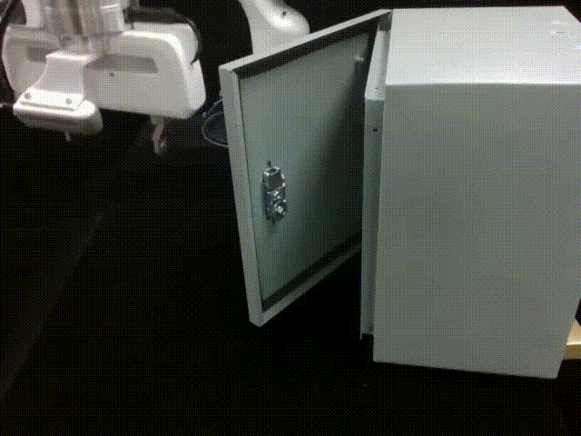

# Human-sourced Diffusion Policy
Official repository for paper "Human-sourced Diffusion Policy for Robust Robotic Manipulation in Safety Monitoring Tasks". We will update the Readme file and the code soon. For appendix materials, please see https://sites.google.com/view/hsdp-appendix/.

## Video of real-world experiments

### Human action data collection

### Robot task performance
1. Press

   

2. Fold

   
   
3. Cabinet

   

4. Assembly

   

5. Drawer

   

6. Pack

   
## Safety monitoring tasks

1. Deploy the sensor

2. Separate the sensor

   
## Reference
- [Diffusion policy](https://github.com/real-stanford/diffusion_policy)
- [Bridger](https://github.com/clear-nus/bridger)
- [QueST](https://github.com/pairlab/QueST)
- [HaMeR](https://github.com/geopavlakos/hamer)

